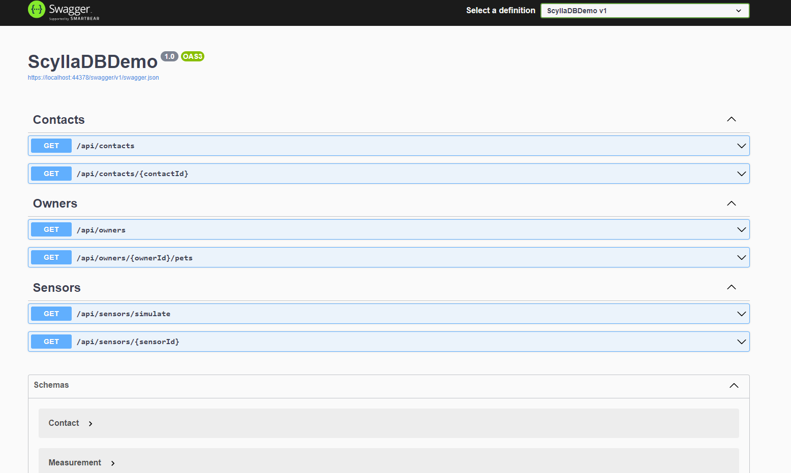

# ScyllaDB-DotNet-Demo

Team Six ScyllaDB Research

## Quick start

Create the cluster,

```sh
npm run create
```


Check it's running....

```sh
npm run status
```

Then run the dotnet project to trigger the migrations and some sample seed data

Visit the Swagger docs and check you can see the seeded contacts at `/api/contacts`,
<https://localhost:44378/swagger/index.html>


## Examples




## Further Reading

* On starting a single node instance quickly: https://propertyme.atlassian.net/wiki/spaces/TS/pages/3206938666/Setup+ScyllaDb+locally
* C# datatype mappings: https://docs.datastax.com/en/developer/csharp-driver/3.20/features/datatypes/index.html
* Datastax driver docs: https://docs.datastax.com/en/developer/csharp-driver/3.20/index.html

