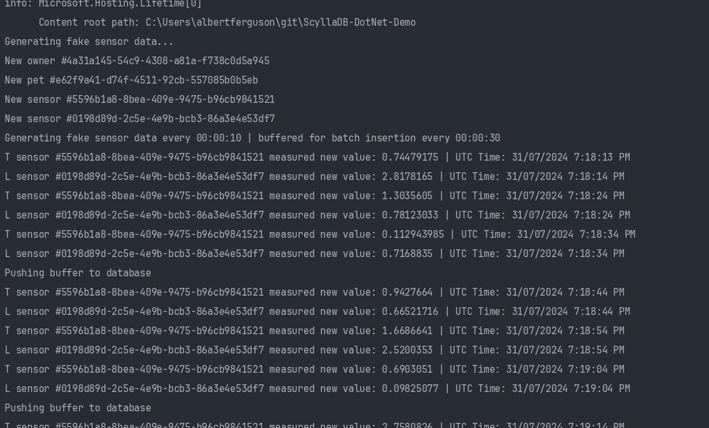
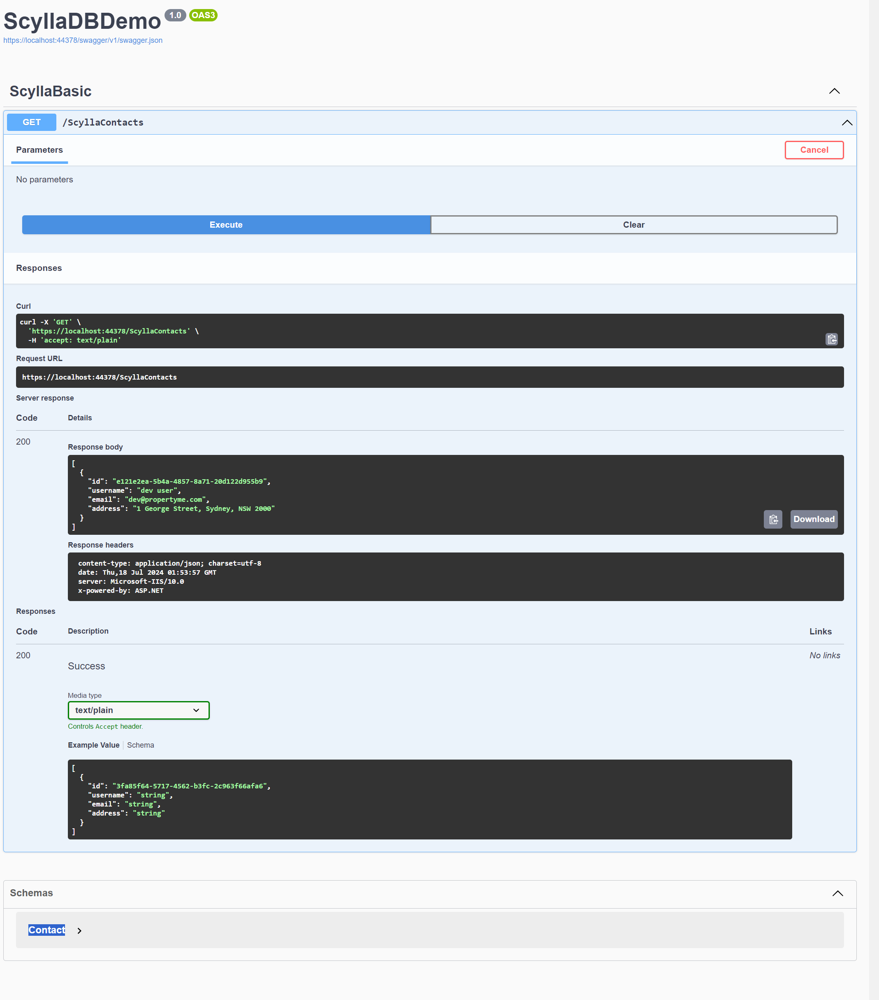

# ScyllaDB-DotNet-Demo
Team Six ScyllaDB Research

## Scyalla DB Documentation
https://propertyme.atlassian.net/wiki/spaces/TS/pages/3206938666/Setup+ScyllaDb+locally


## Quick start

Create the container,

```sh
npm run create
```


Check it's running....

```sh
npm run status
```

... and run the demo migrations manually,

```sh
docker exec -it scylla cqlsh
```

```sql
-- create a new keyspace
-- note that we have a replication factor of 1, as only 1 node is configured (at min. 3 is recommended but this is fine for demo purposes),
-- durable writes 'true' enables node replication (recommended)
CREATE KEYSPACE local_dev WITH replication ={'class': 'SimpleStrategy', 'replication_factor': 1} and durable_writes = true;

-- use that keyspace
Use local_dev;

-- create a new table
CREATE TABLE contact (
	id UUID PRIMARY KEY,
	username TEXT,
	email TEXT,
	address TEXT
);

-- insert some data
INSERT INTO contact (id, username, email, address)
VALUES (uuid(), 'dev user', 'dev@propertyme.com', '1 George Street, Sydney, NSW 2000');
```

Then run the dotnet project and visit the Swagger site to demo the contacts endpoint here,
<https://localhost:44378/swagger/index.html>


## Examples



